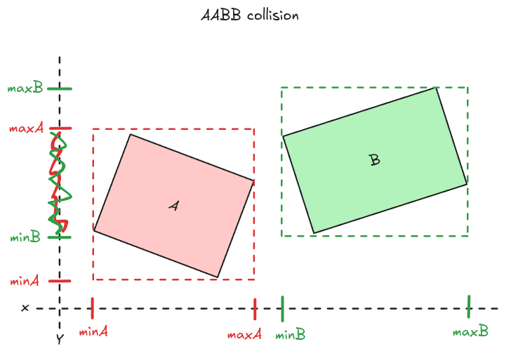
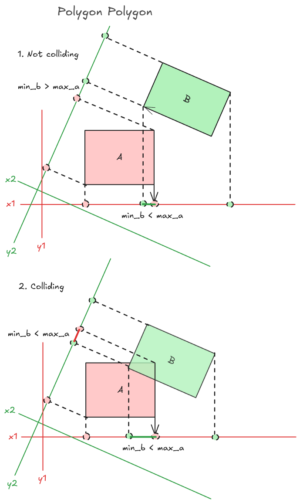
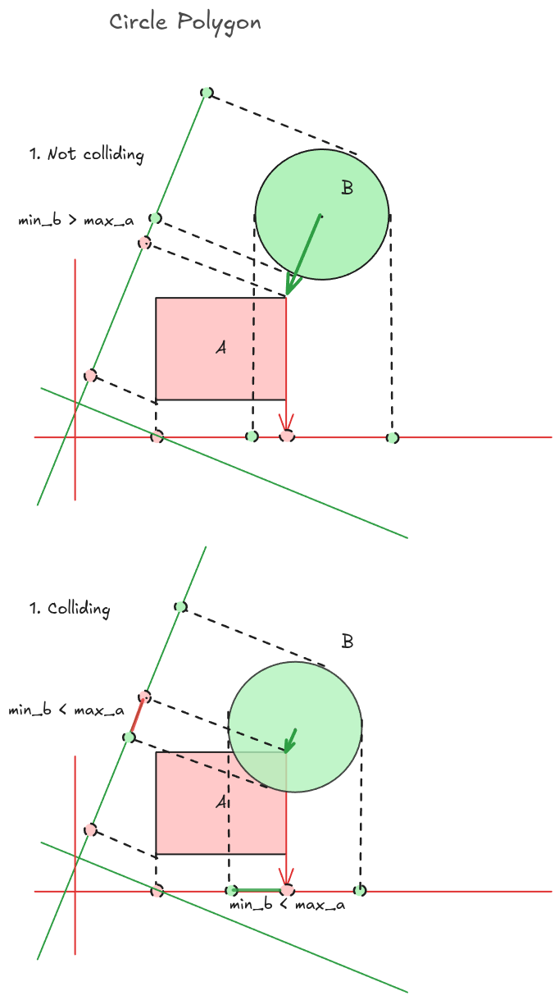
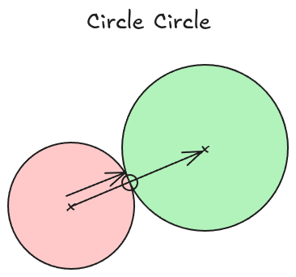
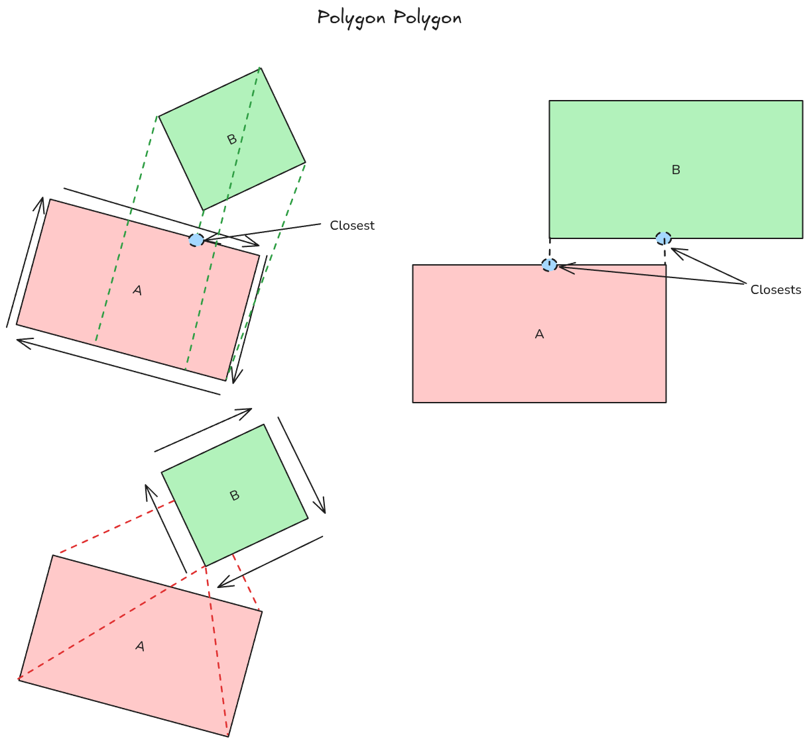
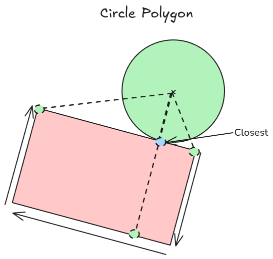
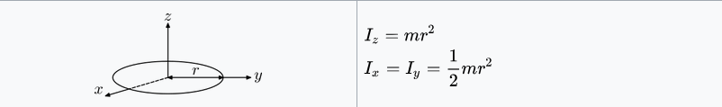
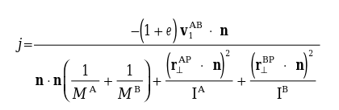

# 2D physic engine demo 
This project contains physics engine written in Rust using Bevy game engine. The codebase is based on youtube video series by [Two-Bit Coding](https://www.youtube.com/playlist?list=PLSlpr6o9vURwq3oxVZSimY8iC-cdd3kIs).

# What the engine is doing
## Physics step
First the engine applyes linear and angular velocities and gravity to transform of a flat body. 

## Broad phase
In this step we detect if flat bodies are colliding using aabb collision. We save colliding objects for further processing

## Narrow phase
Now we iterate through saved colliding flat body pairs and find normal vector and depth. Normal vector tells us direction how to separate bodies and depth is how deep are the bodies inside each other. For this detection we are using separating axes theorem (SAT).
### SAT
For SAT we need positions of vertecies of the two polygons. We iterate through each side pair to create axis on which we project vertexes of both polygons. Then we check if all the projections are intersecting (min_b < max_a, ...). 

### Separating bodies
By knowing normal vector and depth we can separate objects from each other.

### Finding contact points
To be able to rotate bodies we also need precise points where the bodies are colliding.
For finding out the the contact points we use distance from point to line formula, to find the closest point.

### Resolving collision with rotation and friction
Now we can calculate new angular and linear velocity based on contact points and old angular and linear velocity.

Rotational inertia formulas:

Formula for new linear and angular velocity using impulse:

# Further possible improvements
- The bodies will start to wobble if stacked on each other
- Better integration with the engine
- Make it into a package for others to use
